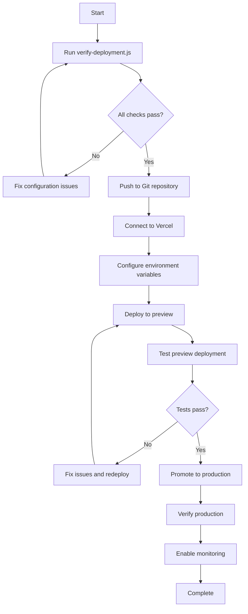

# Deployment Configuration Files

This document describes all the deployment-related files created for The MEV Exorcist frontend.

## Configuration Files

### `vercel.json`
**Purpose**: Vercel platform configuration  
**Contains**:
- Build command and output directory
- Framework detection (Next.js)
- Security headers (CSP, X-Frame-Options, etc.)
- HTTP header configuration for all routes

**Key Features**:
- Content Security Policy allows WebSocket connections
- Prevents clickjacking with X-Frame-Options
- Restricts browser permissions
- MIME type sniffing protection

### `next.config.mjs`
**Purpose**: Next.js build configuration  
**Contains**:
- ESLint configuration (ignore during builds)
- TypeScript configuration
- Build optimization settings

**Key Features**:
- Allows production builds to succeed even with test file linting issues
- Maintains type safety during builds

### `.env.local.example`
**Purpose**: Local development environment variables template  
**Contains**:
- Backend URL for local development
- Etherscan base URL
- Documentation for each variable

**Usage**: Copy to `.env.local` and fill in values for local development

### `.env.production.example`
**Purpose**: Production environment variables template  
**Contains**:
- Backend URL for production deployment
- Etherscan base URL
- Instructions for Vercel configuration

**Usage**: Reference when configuring environment variables in Vercel Dashboard

## Documentation Files

### `DEPLOYMENT.md`
**Purpose**: Comprehensive deployment guide  
**Sections**:
1. Prerequisites and setup
2. Environment variable configuration
3. Build configuration details
4. Step-by-step deployment instructions
5. Testing procedures (browser, device, functional)
6. Troubleshooting guide
7. Performance optimization
8. Security considerations
9. Rollback procedures

**Audience**: Developers performing initial deployment or troubleshooting

### `DEPLOYMENT-CHECKLIST.md`
**Purpose**: Quick reference checklist  
**Sections**:
- Pre-deployment checks
- Vercel configuration
- Environment variables
- Testing checklist (basic, functional, performance, security)
- Post-deployment tasks
- Troubleshooting quick fixes
- Sign-off section

**Audience**: Developers who need a quick checklist to ensure nothing is missed

### `DEPLOY-QUICKSTART.md`
**Purpose**: Fast-track deployment guide  
**Sections**:
- 5-step deployment process
- Quick troubleshooting
- Production checklist
- Time estimates

**Audience**: Experienced developers who need to deploy quickly

### `DEPLOYMENT-FILES.md` (this file)
**Purpose**: Documentation of deployment files  
**Audience**: Developers who need to understand the deployment configuration structure

## Utility Scripts

### `verify-deployment.js`
**Purpose**: Automated verification of deployment configuration  
**Checks**:
- Required files exist
- vercel.json is properly configured
- Security headers are present
- CSP allows WebSocket connections
- package.json has required scripts and dependencies
- Environment variables are documented
- Next.js configuration is correct
- Documentation is complete

**Usage**:
```bash
npm run verify-deployment
```

**Output**: Pass/fail report with specific errors and warnings

## File Structure

```
frontend/
├── vercel.json                    # Vercel platform configuration
├── next.config.mjs                # Next.js build configuration
├── .env.local.example             # Local environment template
├── .env.production.example        # Production environment template
├── DEPLOYMENT.md                  # Comprehensive deployment guide
├── DEPLOYMENT-CHECKLIST.md        # Quick reference checklist
├── DEPLOY-QUICKSTART.md           # Fast-track deployment guide
├── DEPLOYMENT-FILES.md            # This file
├── verify-deployment.js           # Automated verification script
└── README.md                      # Updated with deployment section
```

## Deployment Workflow



## Environment Variables Reference

| Variable | Required | Default | Description |
|----------|----------|---------|-------------|
| `NEXT_PUBLIC_BACKEND_URL` | Yes | - | Backend Socket.io server URL |
| `NEXT_PUBLIC_ETHERSCAN_BASE` | Yes | - | Etherscan base URL for transaction links |

**Important Notes**:
- All variables must be prefixed with `NEXT_PUBLIC_` to be accessible in the browser
- Variables must be configured in Vercel Dashboard for all environments (Production, Preview, Development)
- Changes to environment variables require redeployment to take effect

## Security Headers Reference

| Header | Value | Purpose |
|--------|-------|---------|
| Content-Security-Policy | `default-src 'self'; connect-src 'self' wss://* https://*; ...` | Restricts resource loading, allows WebSocket |
| X-Frame-Options | `DENY` | Prevents clickjacking attacks |
| X-Content-Type-Options | `nosniff` | Prevents MIME type sniffing |
| Referrer-Policy | `strict-origin-when-cross-origin` | Controls referrer information |
| Permissions-Policy | `camera=(), microphone=(), geolocation=()` | Restricts browser features |

## Build Configuration Reference

| Setting | Value | Purpose |
|---------|-------|---------|
| Framework | Next.js | Auto-detected by Vercel |
| Build Command | `npm run build` | Compiles Next.js application |
| Output Directory | `.next` | Next.js build output location |
| Node Version | 18.x | Recommended Node.js version |
| Install Command | `npm install` | Installs dependencies |

## Testing Requirements

Before marking deployment as complete, verify:

1. **Build Success**: `npm run build` completes without errors
2. **Configuration Valid**: `npm run verify-deployment` passes all checks
3. **Preview Deployment**: Preview URL loads and functions correctly
4. **Backend Connection**: WebSocket connection to backend established
5. **Browser Compatibility**: Tested on Chrome, Firefox, Safari
6. **Mobile Compatibility**: Tested on iOS and Android
7. **Functional Tests**: All features work as expected
8. **Performance**: Page loads within 2 seconds

## Maintenance

### Updating Configuration

When updating deployment configuration:

1. Modify the appropriate file (vercel.json, next.config.mjs, etc.)
2. Run `npm run verify-deployment` to validate changes
3. Test locally with `npm run build`
4. Commit and push changes
5. Verify in preview deployment
6. Promote to production if successful

### Adding Environment Variables

When adding new environment variables:

1. Add to `.env.local.example` with documentation
2. Add to `.env.production.example` with documentation
3. Update `verify-deployment.js` to check for new variable
4. Update `DEPLOYMENT.md` with configuration instructions
5. Configure in Vercel Dashboard
6. Redeploy application

## Support Resources

- **Vercel Documentation**: https://vercel.com/docs
- **Next.js Deployment**: https://nextjs.org/docs/deployment
- **Socket.io Client**: https://socket.io/docs/v4/client-api/

## Version History

- **v1.0** (Initial): Complete deployment configuration for Vercel
  - vercel.json with security headers
  - Comprehensive documentation
  - Automated verification script
  - Environment variable templates

---

**Last Updated**: Task 18 - Configure frontend deployment  
**Status**: ✅ Complete
